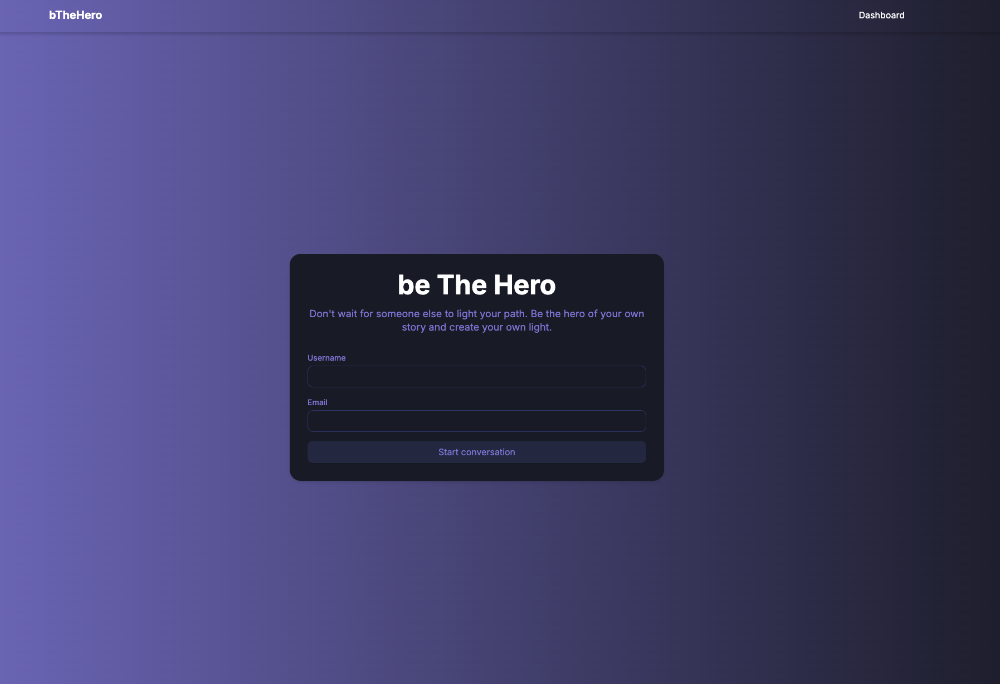

## About the project


This is a chat simulated chat application using Typescript and NextJS if a MongoDB hosted on Atlas.

Some techs used: 
- TailwindCSS
- Zod
- Prisma
- MongoDB (Atlas)
- Jest
- Railway (deploy)


## Getting Started

To run locally
```
npm i
npm run dev
```

To run the tests and coverage
```
npm test
npm test -- --coverage  
```

The application can be access throw that link:

https://be-the-hero-production.up.railway.app/

## Built with


## Useful
https://platform.openai.com/docs/api-reference/making-requests